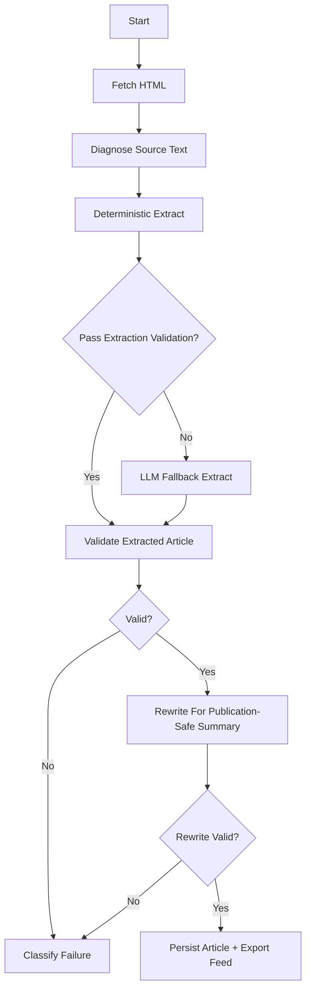

# Rubix Signal

Rubix Signal is a free tech-news briefing product for [Hirubix](https://www.hirubix.com), built to aggregate reporting from multiple sources, extract the core facts, and publish original, publication-safe summaries on `news.hirubix.com`.

The app is a Next.js monolith with a LangGraph-driven ingestion pipeline, Ollama-backed rewriting, Turso/libSQL storage, a public reader experience, and an admin control room for ingestion visibility.

## Vision

- Make high-quality tech news easier to access for free.
- Combine multiple trusted sources into one clean product.
- Remove boilerplate, promo text, and ad residue from extracted content.
- Publish summaries in original wording so the site does not depend on source phrasing.
- Keep the pipeline observable, testable, and safe to operate.

## Latest Product State

This repository now includes the full merged work from the latest security, ingestion, and product-polish passes.

### Security hardening

- Production auth secret enforcement in `src/lib/config.ts`
- Stronger signup validation and body-size checks in `src/app/api/public/auth/signup/route.ts`
- Admin ingestion CSRF protection
- SSRF hardening and redirect-safe remote fetch controls in `src/lib/ssrf.ts`
- Tighter access control and rate-limit behavior for admin and reader auth flows
- Updated security report in `security_best_practices_report.md`

### LangGraph and ingestion improvements

- Deterministic extraction cleanup improved to strip more promo, affiliate, and mojibake residue
- Title-context extraction strengthened to better capture relevant article framing
- Publication-safe rewrite stage added after extraction
- Rewrites are validated against extracted content and full source text
- Additional rewrite retries for stubborn title-originality failures
- Distilled-facts fallback path for difficult articles
- Source-aware policies for heavy or messy publishers
- Newsworthiness filter to skip obvious evergreen guides, commerce roundups, and non-article media pages
- Audit, backfill, and database reset scripts added for repeatable QA

### Product and branding improvements

- Rebranded public experience around Rubix Signal
- Hirubix/Rubix footer presence with link back to the main company site
- About page explaining the product goal
- Better metadata, SEO, icons, and social previews
- Accessibility polish including skip links, focus-visible treatment, dialog improvements, and reduced-motion support
- Public feed and article pages polished to better match the new brand direction

## Core Stack

- Next.js 16 App Router
- React 19
- NextAuth credentials auth
- Turso / libSQL with Drizzle ORM
- LangGraph for per-article orchestration
- Ollama for local structured extraction fallback and summary rewriting
- Export artifacts in `public/news-latest.json` and `data/news-latest.csv`

## What The App Does

- Pulls from curated RSS feeds
- Deduplicates URLs and tracks retry state in the database
- Filters out clearly non-news or non-article items before spending model budget
- Extracts article title, context, body, writer, and publication date
- Validates extracted content against source text
- Rewrites accepted articles into original-language public summaries
- Validates rewritten output for grounding, originality, and unsupported claims
- Stores articles, attempts, run history, events, rate limits, and auth data
- Exports a lightweight feed for the frontend
- Exposes an admin dashboard for run status, event timelines, attempts, and failures

## LangGraph Flow

The per-article orchestration lives in `src/lib/ingestion/article-graph.ts`.

### Graph stages

1. `fetch`
   Pulls the remote article HTML with source-aware timeout settings and SSRF protection.
2. `diagnose`
   Builds source text used for validation and records early diagnostics.
3. `deterministic`
   Runs the fast parser path first using Readability plus source-aware cleanup rules.
4. `decideFallback`
   Checks whether deterministic extraction is good enough or whether LLM fallback is required.
5. `llmFallback`
   Uses Ollama only when deterministic extraction is too weak.
6. `validate`
   Confirms the extracted article is grounded in the source page.
7. `rewrite`
   Produces a publication-safe summary in original wording.
8. `classifyFailure`
   Labels failures as transient or terminal for retry behavior and admin visibility.

### Graph diagram



### Rewrite and copyright-safety layer

The rewrite stage is implemented in `src/lib/ingestion/rewrite-article.ts` and validated in `src/lib/ingestion/rewrite-validation.ts`.

It is designed to:

- keep facts grounded in the source article
- avoid direct reuse of source wording
- remove ad text, affiliate language, newsletters, and promo residue
- preserve important caveats and time windows
- reject unsupported numbers, unsupported uncertainty claims, and unsupported time-window expansions
- retry titles separately when the body is sound but the headline is too close to the source

### Source-aware ingestion policy

Source policy settings live in `src/lib/ingestion/source-policy.ts`.

These tune:

- fetch timeouts
- processing budgets
- LLM HTML truncation size
- retry budgets and cooldowns
- source-specific fallback behavior

### Newsworthiness filter

Pre-ingestion filtering now lives in `src/lib/ingestion/newsworthiness.ts`.

Current rules skip:

- obvious guides / how-to content
- review-style evergreen pages
- consumer-commerce roundup pages
- non-article media pages such as `/video/`

## Ingestion Lifecycle

App-level orchestration lives in `src/lib/ingestion/run-ingestion.ts`.

### End-to-end pipeline

1. Fetch feed entries from the curated catalog
2. Normalize and deduplicate URLs
3. Filter out non-news items
4. Queue eligible links
5. Process each article through the LangGraph flow
6. Persist successful rewritten articles
7. Record attempts and event logs
8. Export JSON and CSV artifacts for the frontend

### Observability

The admin dashboard acts as a lightweight ingestion control room and surfaces:

- active run status
- last completed run
- run timeline and feed discovery events
- article-level attempts
- failed links with retry classification
- LangGraph node-level event telemetry
- reader signup stats

## Repository Highlights

- `src/lib/ingestion/article-graph.ts`: per-article LangGraph workflow
- `src/lib/ingestion/run-ingestion.ts`: feed discovery and run orchestration
- `src/lib/ingestion/deterministic-extract.ts`: deterministic extraction and cleanup
- `src/lib/ingestion/llm-extract.ts`: structured fallback extraction
- `src/lib/ingestion/rewrite-article.ts`: publication-safe rewrite stage
- `src/lib/ingestion/rewrite-validation.ts`: rewrite originality and grounding checks
- `src/lib/ingestion/newsworthiness.ts`: pre-ingestion filtering
- `src/lib/db.ts`: canonical DB access and retention logic
- `src/app/about/page.tsx`: about page for the product mission
- `src/components/site-footer.tsx`: Hirubix-linked footer content
- `security_best_practices_report.md`: security review notes

## Requirements

- Node.js `22.17.1` recommended
- Ollama running locally
- `qwen3:8b` available in Ollama
- Turso/libSQL database credentials

## Local Setup

1. Install dependencies

```powershell
npm install
```

2. Create local env file

```powershell
Copy-Item .env.example .env.local
```

3. Generate an admin password hash if needed

```powershell
npm run admin:hash -- your-strong-password
```

4. Fill in `.env.local`

## Required Environment Variables

```env
AUTH_SECRET=replace-with-random-long-secret
NEXTAUTH_SECRET=replace-with-random-long-secret
NEXTAUTH_URL=http://localhost:3000

ADMIN_USERNAME=admin
ADMIN_PASSWORD_HASH=your-argon2-hash
ADMIN_ENABLED=true
ADMIN_LOCAL_ONLY=true

DATABASE_URL=libsql://your-db-name.turso.io
DATABASE_AUTH_TOKEN=your-turso-auth-token

OLLAMA_BASE_URL=http://127.0.0.1:11434
OLLAMA_MODEL=qwen3:8b

PUBLIC_SIGNUP_ENABLED=true
RATE_LIMIT_ENABLED=true
READER_LOGIN_RATE_LIMIT_ATTEMPTS=15
READER_LOGIN_RATE_LIMIT_WINDOW_MINUTES=15
READER_SIGNUP_RATE_LIMIT_ATTEMPTS=10
READER_SIGNUP_RATE_LIMIT_WINDOW_MINUTES=60
ADMIN_TRIGGER_RATE_LIMIT_ATTEMPTS=10
ADMIN_TRIGGER_RATE_LIMIT_WINDOW_MINUTES=1

PREVIEW_ARTICLE_COUNT=5
VIEW_MORE_INCREMENT=6
```

## Useful Optional Environment Variables

```env
RSS_FEEDS=
MAX_ARTICLES_IN_EXPORT=100
INGEST_MAX_RETRIES=3
INGEST_RETRY_COOLDOWN_MINUTES=30
INGEST_CONCURRENCY=4
WORKER_INTERVAL_MINUTES=60
WORKER_ALIGN_TO_INTERVAL=false
WORKER_RUN_ON_START=true
USE_LLM_FALLBACK=true
ARTICLE_FETCH_TIMEOUT_MS=20000
ARTICLE_PROCESS_TIMEOUT_MS=60000
LLM_HTML_MAX_CHARS=45000

ARTICLE_RECORD_LIMIT=500
ARTICLE_PRUNE_COUNT=100
ARTICLE_LINK_RECORD_LIMIT=650
ARTICLE_LINK_PRUNE_COUNT=150
INGEST_RUN_RECORD_LIMIT=200
INGEST_RUN_PRUNE_COUNT=50
INGEST_ATTEMPT_RECORD_LIMIT=1200
INGEST_ATTEMPT_PRUNE_COUNT=250
INGEST_EVENT_RECORD_LIMIT=5000
INGEST_EVENT_PRUNE_COUNT=1000
LOGIN_AUDIT_RECORD_LIMIT=500
LOGIN_AUDIT_PRUNE_COUNT=100
```

## Database Setup

Push the schema to Turso:

```powershell
npm run db:push -- --force
```

## Running Locally

Frontend:

```powershell
npm run dev
```

One ingest, then frontend:

```powershell
npm run dev:with-ingest
```

Worker loop:

```powershell
npm run worker
```

Useful local routes:

- Feed: [http://localhost:3000](http://localhost:3000)
- Login: [http://localhost:3000/login](http://localhost:3000/login)
- Admin: [http://localhost:3000/admin](http://localhost:3000/admin)

## Auth Model

### Admin auth

- Protected by NextAuth credentials auth and middleware
- Can be disabled with `ADMIN_ENABLED=false`
- Can be restricted to localhost with `ADMIN_LOCAL_ONLY=true`
- Manual admin ingestion is CSRF-protected

### Reader auth

- Readers can sign up with email/password
- Passwords are stored as Argon2 hashes
- Signup and login are rate-limited in production
- Anonymous visitors get only a teaser feed
- Full article access is gated behind reader auth

## Quality Assurance Workflow

The repository now includes explicit scripts for validating ingestion quality against source pages.

### Fresh validation flow

```powershell
npm run db:reset
npm run ingest
npm run audit:latest -- 25
```

### What the QA scripts do

- `db:reset`
  Clears app tables and resets exported feed artifacts
- `audit:latest`
  Re-fetches the newest stored articles, re-extracts source text, reruns rewrite validation, and asks the model for a factual/coverage verdict
- `backfill:rewrite`
  Reprocesses the latest stored articles under the latest rewrite rules

This makes it easy to test whether the public summaries still match the underlying article facts after pipeline changes.

## Commands

- `npm run dev`: start frontend
- `npm run dev:with-ingest`: ingest once, then start frontend
- `npm run ingest`: run one ingestion pass
- `npm run worker`: run the scheduled worker loop
- `npm run export:news`: rebuild JSON and CSV exports from DB
- `npm run backfill:rewrite`: reprocess latest stored articles through the rewrite layer
- `npm run audit:latest -- <n>`: audit the latest `n` stored articles against source content
- `npm run db:reset`: clear DB content and reset exports
- `npm run feeds:check`: validate curated feeds
- `npm run admin:hash -- <password>`: generate admin password hash
- `npm run admin:set-password -- <password> [--username=admin]`: update local admin credentials
- `npm run db:generate`: generate Drizzle migration files
- `npm run db:push`: push schema to Turso
- `npm run db:studio`: open Drizzle Studio
- `npm run test`: run tests
- `npm run lint`: run ESLint
- `npm run build`: production build check

## Docker

The repo includes a local Docker stack for an always-on app plus a scheduled worker.

Files:

- `Dockerfile`
- `docker-compose.yml`
- `.dockerignore`

Start:

```powershell
docker compose up -d --build
```

Stop:

```powershell
docker compose down
```

Logs:

```powershell
docker compose logs -f app
docker compose logs -f worker
docker compose logs -f app worker
```

## Curated Feeds

- Default feed catalog: `src/lib/ingestion/feeds.json`
- Leave `RSS_FEEDS` blank to use the curated default catalog
- Or provide a comma-separated override list

## Security Notes

- Admin and reader passwords use Argon2 hashes
- Login attempts are audited
- SSRF protections block local/private network fetch targets
- Signup and login rate limiting is narrow by design
- Extraction and rewritten output are both validated against source material
- Production auth secret configuration is enforced
- Sensitive admin flows are designed for local/private operation by default

## Deploying

For public hosting, the recommended posture is:

- keep the public site deployed
- keep admin disabled or strictly private
- run ingestion from a trusted environment that can reach Ollama

Typical production env highlights:

```env
DATABASE_URL=libsql://your-db-name.turso.io
DATABASE_AUTH_TOKEN=your-turso-auth-token
NEXTAUTH_SECRET=replace-with-random-long-secret
NEXTAUTH_URL=https://news.hirubix.com
PUBLIC_SIGNUP_ENABLED=true
RATE_LIMIT_ENABLED=true
ADMIN_ENABLED=false
ADMIN_LOCAL_ONLY=true
OLLAMA_BASE_URL=http://your-reachable-ollama-host:11434
OLLAMA_MODEL=qwen3:8b
```

If your hosted environment cannot safely reach Ollama, keep admin ingestion disabled there and run ingestion from your controlled machine or worker environment instead.

## Current Status Summary

The project now ships with:

- Hirubix-aware branding and footer integration
- an About page explaining the product goal
- a LangGraph-first ingestion pipeline with deterministic extraction, fallback extraction, validation, and publication-safe rewriting
- source-aware cleanup and retry policy
- newsworthiness filtering before model spend
- admin observability for article-graph events and run telemetry
- security hardening across auth, admin triggers, signup handling, and SSRF protection
- repeatable reset, backfill, and audit scripts for end-to-end validation
